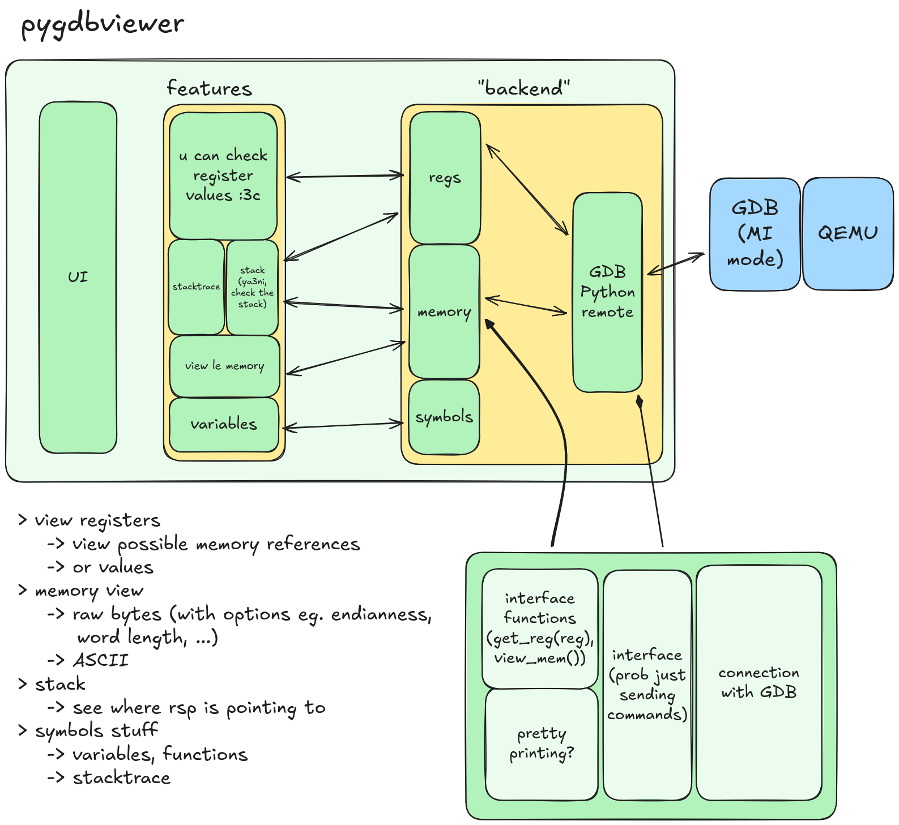
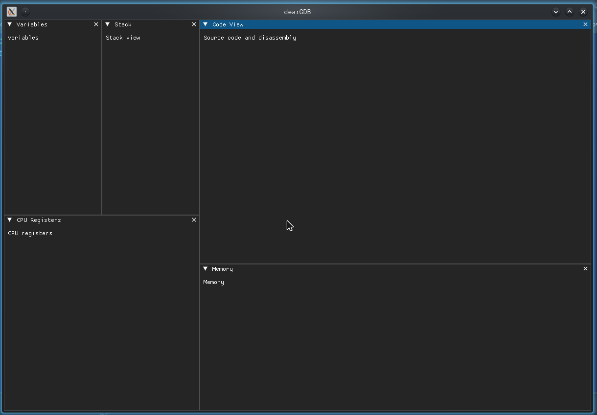
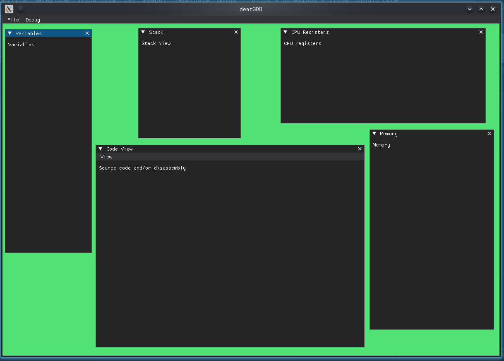

# pyDearGDB

a custom GDB UI made with Python and [DearPyGui](https://dearpygui.readthedocs.io/en/latest/)

## ⚠️⚠️ THIS IS ALPHA SOFTWARE ⚠️⚠️

# How does it work??

I made this scheme about 2 weeks before actually doing something, it's not accurate but it should be enough:



> (Ignore the QEMU part for now)

# Prerequisites

You need these python libraries installed:

- `dearpygui`: the Dear ImGui implementation for python
- `pygdbmi`: the bridge between Python and GDB

# How to run

You should run pyDearGDB from your project's directory (i.e. `python3 ../pyDearGDB/main.py`, below is the structure i work with)
```
.
├──pyDearGDB
│  ├──main.py
│  └──...
└──[your project directory here]
```
You **must** give to `main.py` the path to the executable you want to debug, for example:

```sh
python3 ../pyDearGDB/main.py build/main
```
**BTW, if you don't give the executable path, the script won't run anyways and will show you the available arguments : )**

> oh i forgot, you can do `main.py -h` to show the arguments 

You can additionally pass a GDB script with the `-x` flag:
```sh
python3 ../pyDearGDB/main.py build/main -x path/to/script.gdb
```

# What can I do?

pyDearGDB can't do anything for now, but here's a cool preview for the current UI status:



BTW if you don't like how i arranged the windows, you can move them as you like (so you can reveal the background color : )

